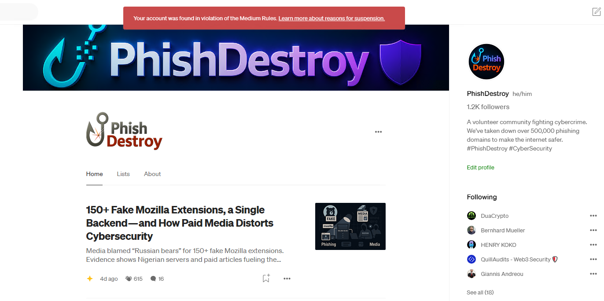

# 📖 Medium Archive — PhishDestroy

  
  
<strong>Phishing exposés banned by Medium. Preserved here.</strong>

---

## ❌ Account Terminated ⚰️

<figure align="center">
  
  <figcaption><i>@phishdestroy on Medium before takedown</i></figcaption>
</figure>

The account was banned by Medium.  
No proper export tools, no appeal, no explanation.  

- 📉 Original articles deleted  
- 🖨️ Exported snapshot preserved here  
- 🔮 Limited number of posts archived  
- 🐭 Medium silently wiped the account

---

## 📂 Archive Contents

| File / Folder   | Description                               |
|-----------------|-------------------------------------------|
| `index.html`    | Landing page of the archive               |
| `posts/`        | Published posts and exposés               |
| `bookmarks/`    | Saved links and references                |
| `claps/`        | Acknowledged articles                     |
| `profile/`      | Account profile metadata                  |
| `screen.png`    | Screenshot of terminated account          |
| `img.png`       | Repo banner image                         |

---

## 📊 Data Export

⬇️ Snapshot of the banned Medium account preserved.  
Includes posts, bookmarks, highlights, and profile data.  
All content structured for readability and preservation.

---

## 👨‍💻 Active Threat Channels

The work continues daily across multiple platforms:

| Platform   | Feed / URL                                              |
|------------|----------------------------------------------------------|
| 🐦 Twitter/X | [@Phish_Destroy](https://x.com/Phish_Destroy)          |
| 🐤 Telegram  | [@PhishDestroyAlerts](https://t.me/PhishDestroyAlerts) |
| 🐼 Mastodon  | [@phishdestroy@mastodon.social](https://mastodon.social/@phishdestroy) |
| 🌐 Ghost     | [phishdestroy.ghost.io](https://phishdestroy.ghost.io) |
| 🦖 Database  | [`list.json`](https://github.com/phishdestroy/destroylist/blob/main/list.json) |

  
  

---

## 👶 Message to Scam Networks 💩

Banning names changes nothing.  
Posts are restored, preserved, and multiplied.  

Your scam domains still get blocked.  
That’s not a threat — **that’s a guarantee.**

---

## 👮 Legal Notice

- All data is public, OSINT-based, and threat-related only  
- No personal or private information is included  
- Published only for research, evidence, and digital preservation

---

  

