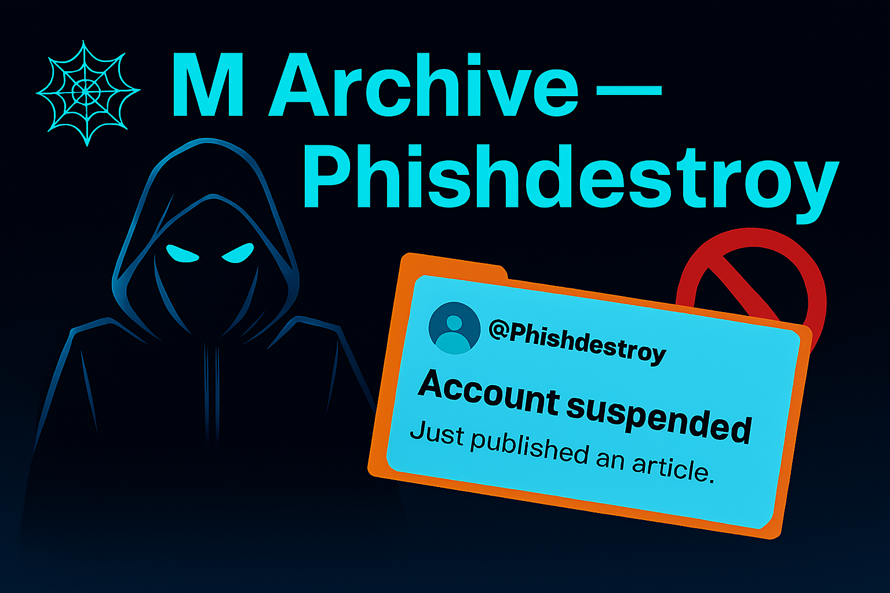

# 📖 Medium Archive — PhishDestroy

  
  
<strong>Phishing exposés published on Medium. Banned. Preserved here.</strong>

  
  
  

---

## ❌ Account Terminated ⚰️

<figure align="center">
  
  <figcaption><i>PhishDestroy Medium account before ban</i></figcaption>
</figure>

For more than a year, we submitted **lists with tens of thousands of phishing reports**.  
Mostly **crypto airdrop scams with drainer scripts** that dominated search engines and took first positions.  

Our own articles strictly followed Medium’s rules:  
- 🔍 OSINT investigations  
- 🌐 Domain analysis and registrar evidence  
- ✅ No personal data, no violations  

We have nothing to hide — so here is an **almost full export of our account**, across all categories.  

Medium, instead of supporting this work, chose to keep **AI-generated scam spam** published from thousands of unverified accounts.  

---

## 📂 Archive Contents

| File / Folder   | Description                         |
|-----------------|-------------------------------------|
| `index.html`    | Landing page of the archive         |
| `posts/`        | Published articles                  |
| `bookmarks/`    | Saved links and references          |
| `claps/`        | Acknowledged articles               |
| `profile/`      | Account profile data                |
| `screen.png`    | Screenshot of suspended account     |
| `img.png`       | Repo banner image                   |

---

## 👨‍💻 Active Threat Channels

The work continues daily across our main platforms:

| Platform   | Feed / URL                                              |
|------------|----------------------------------------------------------|
| 🐦 Twitter/X | [@Phish_Destroy](https://x.com/Phish_Destroy)          |
| 🐤 Telegram  | [@PhishDestroyAlerts](https://t.me/PhishDestroyAlerts) |
| 🐼 Mastodon  | [@phishdestroy@mastodon.social](https://mastodon.social/@phishdestroy) |
| 🌐 Ghost     | [phishdestroy.ghost.io](https://phishdestroy.ghost.io) |
| 🦖 Database  | [`list.json`](https://github.com/phishdestroy/destroylist/blob/main/list.json) |

  
  

---

## 👶 Message to Scam Networks 💩

Banning accounts doesn’t stop us.  
Reports multiply. Data is preserved.  
Your scam domains keep getting blocked.  

That’s not a threat — **that’s a guarantee.**

---

## 👮 Legal Notice

- All data is public and OSINT-based  
- No personal/private information included  
- Published only for research, evidence, and digital preservation  

---

  

